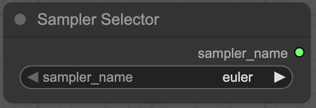
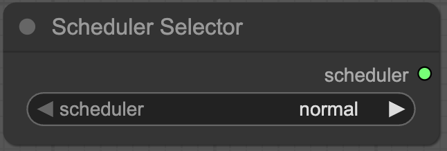
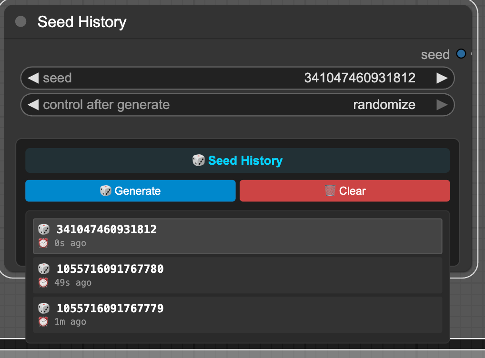
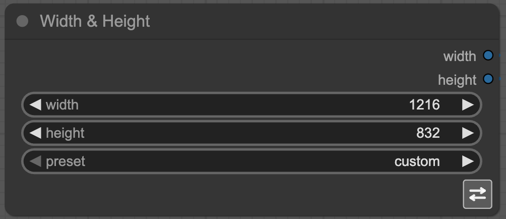

# ComfyUI Selectors

[](https://github.com/ComfyAssets/ComfyUI_Selectors/actions/workflows/ci.yml)

**Version 1.0**

A modern ComfyUI custom node package that provides essential UI controls for image generation workflows. These nodes allow you to centralize commonly shared parameters (scheduler, sampler, dimensions, seeds) and link them to multiple nodes in your workflow, eliminating redundancy while maintaining JSON metadata compatibility.

## Features

- **Sampler Selector**: Choose from all current ComfyUI-supported sampling methods
  - 

- **Scheduler Selector**: Select from all current ComfyUI-supported schedulers
  - 

- **Seed History**: Generate, increment, or randomize seeds with advanced controls and history tracking
  - 

- **Width & Height Nodes**: Individual dimension controls with preset support
- 
- **Combined Width/Height Node**: Dual dimension control with swap functionality and presets
- **Modern ComfyUI Standards**: Follows 2024 ComfyUI development best practices
- **JSON Compatible**: Maintains workflow JSON compatibility for sharing and version control

## Installation

1. Navigate to your ComfyUI `custom_nodes` directory
2. Clone this repository:
   ```bash
   git clone https://github.com/ComfyAssets/ComfyUI_Selectors.git
   ```
3. Restart ComfyUI
4. The nodes will appear in the `comfyassets/` category

## Available Nodes

### Sampling Nodes (`comfyassets/Sampling`)

#### Sampler Selector

- **Function**: Centralized sampler selection
- **Output**: Sampler name for use in KSampler nodes
- **Supported Samplers**: All current ComfyUI samplers including euler, dpmpp_2m, ddim, etc.

#### Scheduler Selector

- **Function**: Centralized scheduler selection
- **Output**: Scheduler name for use in KSampler nodes
- **Supported Schedulers**: normal, karras, exponential, sgm_uniform, simple, ddim_uniform, beta

### Generation Nodes (`comfyassets/Generation`)

#### Seed History

- **Function**: Advanced seed management with web-based controls and history tracking
- **Input**:
  - `seed`: Base seed value (0-18446744073709551615)
- **Web UI Features**:
  - **Control Mode**: Dropdown to set behavior after generation
    - `Fixed`: Keep seed unchanged
    - `Increment`: Add 1 to seed after each generation
    - `Decrement`: Subtract 1 from seed after each generation
    - `Randomize`: Generate new random seed after each generation
  - **Seed History**: Automatically tracks and displays the last 5 seeds used
  - **One-Click Reuse**: Click any seed in history to instantly load it
  - **Generate New**: Quick button to generate and apply a new seed based on control mode
  - **Clear History**: Reset the seed history cache
  - **Persistent Storage**: Both seed history and control mode persist across ComfyUI sessions
- **Output**: Seed value for use in KSampler nodes

### Dimension Nodes (`comfyassets/Dimensions`)

#### Width Node

- **Function**: Image width selection with presets
- **Controls**:
  - `width`: Custom width value (64-8192, step 8)
  - `preset`: Quick selection (custom, 512, 768, 1024, 1152, 1216, 1344, 1408, 1472, 1536)
- **Output**: Width value for use in latent image nodes

#### Height Node

- **Function**: Image height selection with presets
- **Controls**:
  - `height`: Custom height value (64-8192, step 8)
  - `preset`: Quick selection (custom, 512, 768, 1024, 1152, 1216, 1344, 1408, 1472, 1536)
- **Output**: Height value for use in latent image nodes

#### Width & Height Node

- **Function**: Combined dimension control with advanced features
- **Controls**:
  - `width`: Custom width value (64-8192, step 8)
  - `height`: Custom height value (64-8192, step 8)
  - `preset`: Common dimension presets (512x512, 768x512, 1024x768, etc.)
  - `swap_dimensions`: Toggle to swap width and height values
- **Outputs**: Both width and height values
- **Presets Include**: Square formats, landscape, portrait, and popular ratios

## Usage Examples

### Basic Workflow Setup

1. Add a **Sampler Selector** node and choose your preferred sampler
2. Add a **Scheduler Selector** node and choose your scheduler
3. Add a **Seed History** node and set control mode
4. Add a **Width & Height Node** and choose dimensions
5. Connect outputs to your KSampler and latent image nodes

### Centralized Parameter Management

- Use selector nodes to set parameters once
- Connect outputs to multiple destination nodes
- Change settings in one place to affect entire workflow
- Maintain clean, organized node graphs

### Preset Workflows

- Use dimension presets for quick setup of common aspect ratios
- Use seed randomize mode for variation generation
- Combine nodes for complex parameter linking scenarios

## Technical Details

### ComfyUI Compatibility

- Built for ComfyUI 2024+ standards
- Compatible with all current sampler and scheduler types
- Maintains JSON workflow compatibility
- Supports widget conversion and parameter linking

### Node Categories

- `comfyassets/Sampling`: Sampler and scheduler selection
- `comfyassets/Generation`: Seed and generation control
- `comfyassets/Dimensions`: Width, height, and dimension control

### Output Types

- **Sampler/Scheduler**: ComfyUI COMBO types with current options
- **Dimensions/Seeds**: Standard INT types with proper validation
- **JSON Metadata**: Maintains workflow sharing compatibility

## Development

### Setup

1. **Create virtual environment:**

   ```bash
   python -m venv venv
   source venv/bin/activate  # Linux/Mac
   # or
   venv\Scripts\activate     # Windows
   ```

2. **Install development dependencies:**
   ```bash
   pip install -r requirements-dev.txt
   ```

### Testing

The project includes comprehensive testing with mock ComfyUI environment:

```bash
# Run all tests (recommended)
python run_tests.py

# Run individual pytest tests
pytest tests/unit/           # Unit tests
pytest tests/integration/    # Integration tests

# Check code formatting
black --check .
isort --check-only .
flake8 .
```

### Project Structure

```
nodes/                   # ComfyUI node implementations
web/                     # Web UI components and extensions
├── seed_history.js     # Seed History UI
└── width_height_swap.js # Width/Height node swap functionality
tests/                   # Test suites with mock ComfyUI
├── mocks/              # Mock ComfyUI modules
├── unit/               # Unit tests
└── integration/        # Integration tests
run_tests.py            # Standalone test runner
requirements-dev.txt    # Development dependencies
```

### Contributing

1. Follow ComfyUI development standards
2. Use the provided test framework with mock ComfyUI environment
3. Maintain backward compatibility
4. Add tests for new functionality
5. Update documentation
6. Ensure all tests pass before submitting PRs

### Code Quality

- **Formatting:** Black (88 character line limit)
- **Import sorting:** isort
- **Linting:** flake8
- **Testing:** Custom test runner with comprehensive mock setup

## Version History

### Version 1.0 (Initial Release)

- ✅ Sampler Selector with all current ComfyUI samplers
- ✅ Scheduler Selector with all current ComfyUI schedulers
- ✅ Seed History with advanced control modes (fixed/increment/decrement/randomize) and history UI
- ✅ Width Node with preset support
- ✅ Height Node with preset support
- ✅ Combined Width & Height Node with swap functionality and dimension presets
- ✅ Modern ComfyUI 2024 standards compliance
- ✅ Full JSON workflow compatibility
- ✅ Comprehensive documentation and testing

## License

This project is licensed under the MIT License - see the [LICENSE](LICENSE) file for details.
